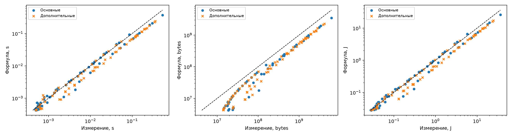

# HW1: аналитическая модель небольшой CNN

[Условие](https://github.com/On-Point-RND/Efficient-Models-course-ITMO-2026/blob/main/home_work_one.md).

Исследуется один forward случайного тензора `B × 3 × S × S`. Сеть не обучается:
основные размеры нужны для подбора коэффициентов времени и энергии, дополнительные - для проверки этих коэффициентов.

## Сеть и соглашения

Шесть Conv+ReLU, MaxPool после первой свёртки, GlobalAvgPool и два Linear.
Архитектура повторяет таблицу задания. BatchNorm в таблице и в измеренной сети отсутствует.
Свёртки: `bias=False`, `padding=k//2`; ReLU: `inplace=True`; у Linear bias включён.
Режим `eval()` + `inference_mode()`, FP32, 1 040 324 параметра.

В `flops` принят расширенный счёт: MAC = 2 операции, сравнение ReLU/MaxPool = 1,
включены GAP и bias Linear. Сравнения отдельно оговариваются, так как формально
это не арифметические FLOPs. Полное окно MaxPool считается и на границах с padding.

```text
F_MAC = B · (17712 S² + 313344)                 # Conv/Linear
F     = B · (17751 S² + 313956)                 # полный номинальный счёт
M     = 4161296 + 52 B S²                       # байты живых тензоров
Q     = 4 · [1040324 + B · (91 S² + 2148)]      # логический трафик, байты
T     = τ + max(α F, β Q)                       # секунды
E     = p₀ T + εF F + εQ Q                      # джоули
```

Функции в `equations.py` принимают скаляры и NumPy-массивы с broadcasting.
M не подгоняется по измерениям. Это приближение к пику `max_memory_allocated()`:
внутренние буферы kernels и округление allocator не включены. Q предполагает одно
чтение/запись каждого тензора оператора и одно чтение параметров за проход; это не
измеренный DRAM-трафик. ReLU учитывается в F, в трафике Q и как inplace в M.

## Среда и измерения

- GPU: Tesla T4, один CUDA device; NVML сопоставляется с ним по UUID.
- PyTorch 2.10.0+cu128, CUDA 12.8, cuDNN 91002.
- `cudnn.benchmark=False`, оба `allow_tf32=False`.
- 10 прогревочных проходов, затем медиана 30 измерений `perf_counter` с CUDA synchronize.
- Память: `reset_peak_memory_stats()` и `max_memory_allocated()` за forward; вход и веса уже на GPU.
- Энергия всей GPU: интеграл мощности NVML методом трапеций за блок не короче 3 секунд / число forward. Отсчёты примерно каждые 50 мс; фоновая мощность не вычитается.

Основные S: 32, 64, 128, 224, 256, 384, 512; B: 1, 2, 4, 8, 16, 32, 64, 128, 256.
Дополнительные S: 48, 400, 352, 112; B: 98, 167, 95. Seed 2026.
Всего 132 комбинации: 63 для подбора коэффициентов и 69 для проверки.
Точка считается дополнительной, если новый хотя бы один из S или B.
Все запуски завершились успешно, OOM не было.

## Воспроизведение

**Новые GPU-замеры:** загрузить `kaggle.ipynb` в Kaggle, включить GPU и Internet
для установки `nvidia-ml-py`, выполнить ячейки сверху вниз. Ноутбук самодостаточный:
дополнительные Python-файлы загружать не требуется. Последняя ячейка выдаст ZIP
с измерениями, метаданными, коэффициентами и основными графиками.

**Пересчёт существующих результатов без GPU:**

```bash
cd hw1
python -m pip install numpy pandas scipy matplotlib
python calibrate.py results
```

Скрипт сохраняет `theta.json`, `metrics.json`, `predictions.csv` и графики.
Исходные `measurements.csv`, `metadata.json` и `flops.csv` не изменяются.
Текущие результаты рассчитаны из уже выполненных замеров; после расширения FLOPs
пересчитаны коэффициенты и графики. Саму сеть и GPU-измерения не меняли.

Для запуска `models.py` нужен PyTorch; зависимости перечислены в `requirements.txt`.
При новых измерениях значения времени, мощности и подобранных параметров могут отличаться.
Чтобы сохранить вывод ячеек в Kaggle, после выполнения нужно сохранить версию ноутбука
и скачать `.ipynb` с выводами. Повторный GPU-запуск для использования приложенных
CSV и графиков не требуется; текущий ноутбук содержит код воспроизведения без сохранённых GPU-выводов.

## Результаты

| Величина | MAPE, основные 63 | MAPE, дополнительные 69 |
|---|---:|---:|
| Время | 16.68% | 26.68% |
| Память | 52.97% | 53.18% |
| Энергия | 14.87% | 23.35% |

MAPE = среднее `100 · abs(predicted / measured - 1)`.
Profiler совпал с F_MAC для всех 11 S при B=1. Дополнительные операции он не измеряет:
полный F на графике показан отдельной аналитической линией.

```text
τ  = 3.643056044726153e-4 s
α  = 3.100138637904379e-13 s/op
β  = 1.2871071276686623e-11 s/byte
p₀ = 66.07872913785941 W
εF = 1.5791163040866524e-12 J/op
εQ = 0 J/byte
```

Параметры T подбирались неотрицательным least squares по относительной ошибке;
параметры E - неотрицательной линейной регрессией после фиксации T. Проверочные
точки не участвовали в подборе. В E используется предсказанное, а не измеренное T.



Кривые по batch для всех S: [время](results/figures/latency_s.png),
[память](results/figures/memory_bytes.png), [энергия](results/figures/energy_j.png).
[Сравнение FLOPs](results/figures/flops.png).

## Обсуждение

Модель воспроизводит общий рост затрат при увеличении S и B, но её точность
ограничена. При малых входах заметны постоянные расходы запуска и синхронизации.
В roofline-модели режим определяется вкладом τ и соотношением αF и βQ.
Такой общий максимум не описывает разные ограничения отдельных слоёв,
изменение загрузки GPU, частот, cache и выбор алгоритмов cuDNN. Названия
launch-bound, memory-bound и compute-bound относятся здесь к модели;
по одним этим графикам нельзя доказать аппаратный bottleneck.

Разница между формами тензора существенна даже при одинаковом BS². Например,
S=32, B=256 и S=512, B=1 имеют одинаковый BS²=262144, но измеренная память
составила соответственно 103.67 и 32.21 MB; базовая формула даёт 17.79 MB в обоих
случаях. Это показывает, что зависимости только от числа элементов недостаточно.
Пропущенные workspace, внутренние тензоры и округление выделений являются
возможными причинами; их отдельные вклады без профилирования не установлены.
Максимальный измеренный пик составил 6.17 GB при S=512, B=256, против 3.49 GB
по формуле. M систематически занижает память; коэффициенты памяти не подгонялись.

Формула не предсказывает OOM на этой сетке, и измеренных OOM тоже нет.
Следовательно, здесь нельзя проверить точность границы OOM. Отсутствие OOM
при ожидаемых в задании больших конфигурациях само по себе не является ошибкой.

Ошибка энергии частично наследуется от времени. Если диагностически заменить
предсказанное T измеренным, оставив коэффициенты E прежними, MAPE энергии
на дополнительных точках уменьшается примерно до 3.76%. Основная функция так
не делает: она должна работать без замера нового входа. Нулевой εQ не означает
нулевой энергии памяти: F и Q связаны, и независимые физические вклады плохо
определяются. Подогнанный p₀ также нельзя интерпретировать как измеренный idle.

Добавление ReLU, pooling и bias меняет счёт операций незначительно и не устраняет
структурные ограничения моделей. Возможное улучшение времени - сумма roofline
по слоям; памяти - учёт конкретных буферов выбранных kernels. В этой работе
оставлена простая модель и явно показаны её ошибки.

## Рукописная часть

[Скан рукописных выкладок](ДЗ1.pdf).
